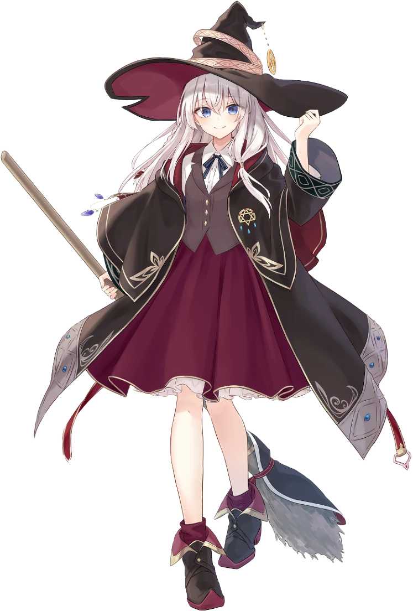

# Elaina

</img>

Elaina (イレイナ) is a character appearing in the light novel Wandering Witch: The Journey of Elaina, written by Jōgi Shiraishi and illustrated by Azure, as well as its derivative works.

Elaina has ashen hair, the source of her witch name. She has been often described as pretty, and cute. Minus her hairstyle, Elaina is shockingly similar to her mother.

Elaina grew up reading stories about the adventures of a witch named Niké, who she does not know is her mother's alias; inspired, she chose to travel the world as well, even being given her mother's old title of "Ashen Witch" upon becoming a full-fledged witch. The story is told through her diary entries.
